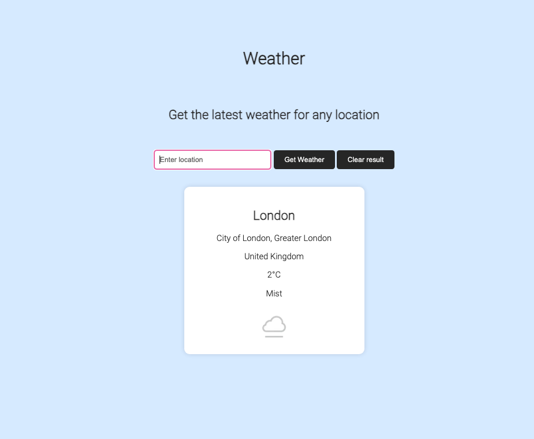

    

<h2 align="center">Weather app</h2>

  

  Check before you go out
  

   
  <a href="https://errantpianist.github.io/odin-weather-app/">View Demo</a>
  

 

## Preview

 

### Built With

- 
- 
- 
- 

## Features

- A weather app implemented using pure HTML/CSS/JS
- Can check current weather for any location using weatherapi

 

## Outcome

- Used async/await to make API calls and load data asynchronously
- Used CSS3 **flex** to manage layout
- Used **webpack**, **NPM** and **Git** to manage project and dependencies

 

## What I learned

- Use of **Javascript** async/await syntax to handle asynchronicity
- Use of a public API - weatherapi

 

## Reflections

This was a quick and simple project. There was plenty more data provided by the API that I could have worked with given more time, and presentation could be more exciting.

 

## Acknowledgments

- Thanks to [The Odin Project](https://www.theodinproject.com/) for putting together such an extensive open-source curriculum!
- Thank you [weatherapi](https://www.weatherapi.com/) for offering a free weather API service!
   

<!-- CONTACT -->

## Author

